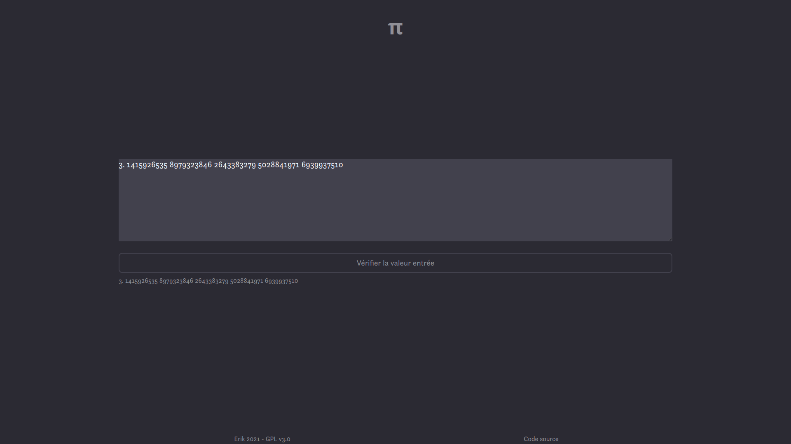

# π
Site web pour tester sa connaissance de pi

## Fonctions
Ce site vous propose d'entrer autant de décimales de pi que vous en connaissez avant d'appuyer sur "Vérifier la valeur entrée". \
Alors, en dessous s'affichera la valeur que vous avez entrée avec les erreurs en rouge. \
De plus, dans la case où vous aurez entré des décimales de pi, les décimales seront séparées en groupes de 10, afin de faciliter la lecture. \
Le site affichera alors également le nombre de décimales entrées. 

## Utilisation
Pour utiliser ce projet, téléchargez le code, puis ouvrez pi.html dans votre naviguateur préféré.

## License
Ce site est publié sous la license [GPLv3](https://www.gnu.org/licenses/gpl-3.0.en.html).
