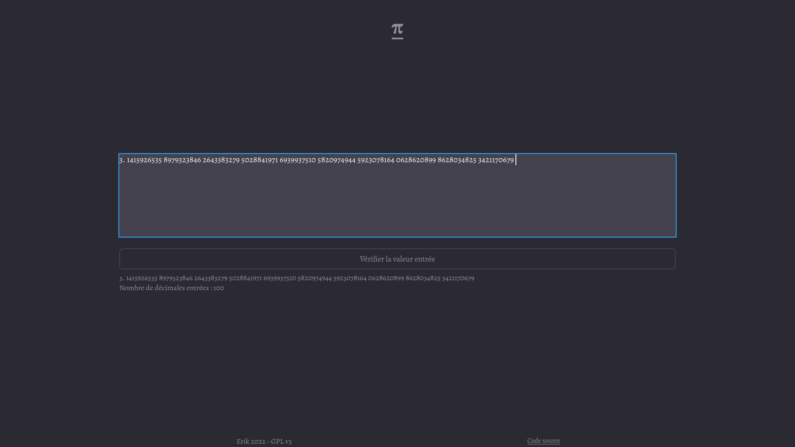
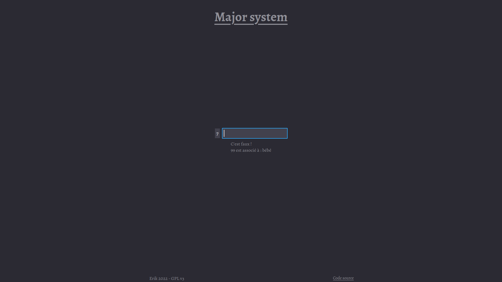

# π

Site web pour tester sa connaissance de pi

## Pages

- `index.html` page d'acceuil avec un lien vers les autres pages
  
- `pi.html` page pour réciter pi. Cette page vous propose d'entrer autant de décimales de pi que vous en connaissez avant d'appuyer sur "Vérifier la valeur entrée". Alors, en dessous s'affichera la valeur que vous avez entrée avec les erreurs en rouge. De plus, dans la case où vous aurez entré des décimales de pi, les décimales seront séparées en groupes de 10, afin de faciliter la lecture.  
  Le site affichera alors également le nombre de décimales entrées.
  
- `pi_valeur.html` page affichant 10 000 décimales de pi
  
- `pi_histoire.html` une histoire pour retenir des décimales de pi
  
- `major_system.html` une liste possible d'associaions entre nombres et mots
  
- `apprendre-major-system.html` une page pour apprendre les associations (il faut taper le mot associé au nombre, puis taper sur <Entrer>)
  

## Utilisation

Pour utiliser ce projet, téléchargez le code, puis ouvrez `index.html` dans votre naviguateur préféré.

## License

Ce site est publié sous la license [GPLv3](https://www.gnu.org/licenses/gpl-3.0.en.html).